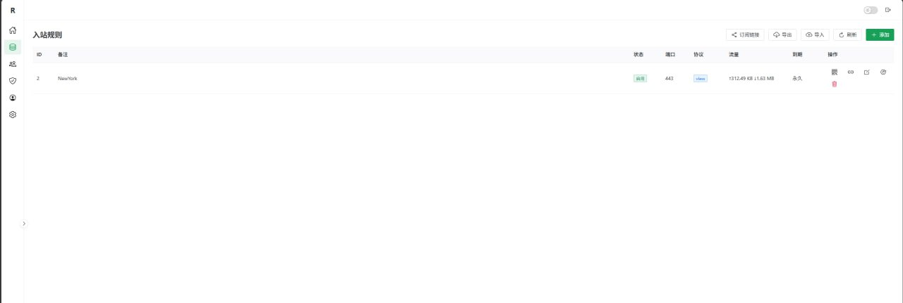
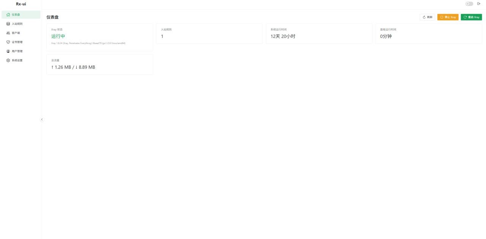

# Rx-ui

基于 x-ui 重构的轻量级 Xray 面板，采用 Go + Vue 3 + Naive UI 架构。


## 项目简介

Rx-ui 提供 Xray 的可视化管理能力，目标是简单、轻量、易部署。

## 功能

- 入站管理：VMess / VLESS / Trojan / Shadowsocks
- 客户端管理：按 Inbound 维护客户端
- 流量统计：基于 Xray StatsService
- 仪表盘：状态与总流量展示
- 证书管理：文件路径导入 / 证书内容导入
- ACME 自动续签：基于 Lego（支持手动续签与自动检查）
- Xray 管理：启动 / 停止 / 重启 / 状态
- 订阅与二维码：链接生成与分享
- 防火墙管理：规则自动 Reconcile

## 展示图





## 部署方法

### 方式一：一键安装（推荐）

```bash
bash <(curl -Ls https://raw.githubusercontent.com/DmLeaves/Rx-ui/main/install.sh)
```

安装后使用：

```bash
Rx-ui
```

常用命令：

```bash
Rx-ui start
Rx-ui stop
Rx-ui restart
Rx-ui status
Rx-ui log
Rx-ui update
Rx-ui uninstall
```

### 方式二：直接运行二进制

```bash
wget https://github.com/DmLeaves/Rx-ui/releases/latest/download/rx-ui-linux-amd64.tar.gz
tar -xzf rx-ui-linux-amd64.tar.gz
./rx-ui-linux-amd64
```

默认访问地址：

```text
http://<服务器IP>:54321
```

默认账号：

- 用户名：`admin`
- 密码：`admin123`

### 方式三：源码构建

```bash
git clone https://github.com/DmLeaves/Rx-ui.git
cd Rx-ui

cd web && npm install && npm run build && cd ..
cp -r web/dist internal/web/

go build -o rx-ui .
./rx-ui
```

## 致谢

- [x-ui](https://github.com/vaxilu/x-ui)
- [Xray-core](https://github.com/XTLS/Xray-core)
- [Naive UI](https://www.naiveui.com/)

## 许可证

MIT License
