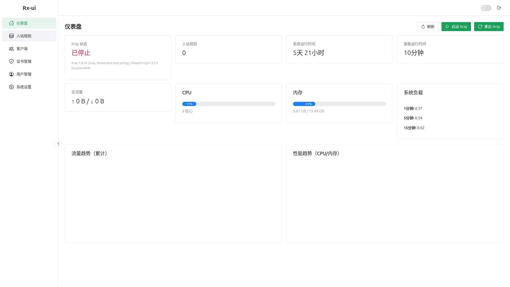
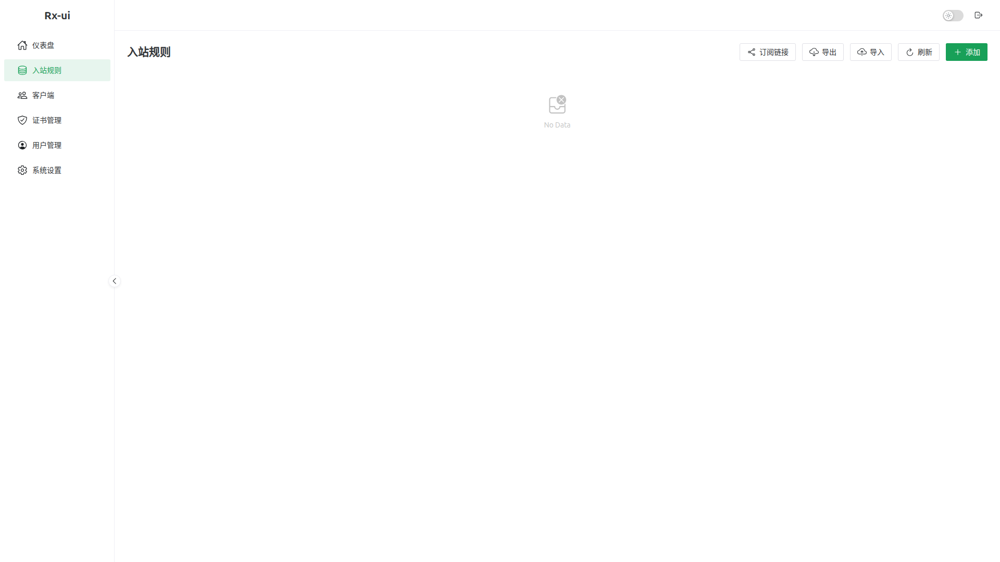

# Rx-ui

基于 x-ui 重构的轻量级 Xray 面板，采用 Go 1.22 + Vue 3 + Naive UI 架构。


## ✨ 特性

- 🚀 **现代化架构** - Go 1.22 + Vue 3 + Naive UI
- 📦 **单文件部署** - 前端嵌入二进制，无需额外依赖
- 🔧 **自动安装 Xray** - 首次运行自动下载安装最新版 Xray
- 🎯 **多协议支持** - VMess / VLESS / Trojan / Shadowsocks
- 📊 **流量统计** - 实时流量监控与统计
- 🔐 **用户管理** - 多用户支持，独立认证
- 🌐 **订阅链接** - 自动生成订阅链接，兼容主流客户端
- 📱 **二维码分享** - 一键生成配置二维码

## 📸 截图

### 仪表盘


### 入站管理


## 🚀 快速开始

### 方式一：直接运行

```bash
# 下载
wget https://github.com/DmLeaves/Rx-ui/releases/latest/download/rx-ui-linux-amd64.tar.gz

# 解压
tar -xzf rx-ui-linux-amd64.tar.gz
cd rx-ui

# 运行（首次运行会自动下载 Xray）
./rx-ui
```

### 方式二：从源码构建

```bash
# 克隆
git clone https://github.com/DmLeaves/Rx-ui.git
cd Rx-ui

# 构建前端
cd web && npm install && npm run build && cd ..

# 复制前端到嵌入目录
cp -r web/dist internal/web/

# 构建后端
go build -o rx-ui .

# 运行
./rx-ui
```

## 📖 使用说明

### 默认配置

| 项目 | 值 |
|------|------|
| 面板端口 | 54321 |
| 用户名 | admin |
| 密码 | admin123 |
| 数据目录 | ./data |
| Xray 路径 | ./bin/xray |

### 访问面板

打开浏览器访问：`http://<服务器IP>:54321`

### API 端点

| 方法 | 路径 | 说明 |
|------|------|------|
| POST | /api/v1/auth/login | 用户登录 |
| GET | /api/v1/inbounds | 获取入站规则列表 |
| POST | /api/v1/inbounds | 创建入站规则 |
| PUT | /api/v1/inbounds/:id | 更新入站规则 |
| DELETE | /api/v1/inbounds/:id | 删除入站规则 |
| GET | /api/v1/clients?inboundId=x | 获取客户端列表 |
| POST | /api/v1/clients | 创建客户端 |
| GET | /api/v1/xray/status | Xray 状态 |
| POST | /api/v1/xray/start | 启动 Xray |
| POST | /api/v1/xray/stop | 停止 Xray |
| POST | /api/v1/xray/restart | 重启 Xray |
| GET | /api/v1/system/status | 系统状态 |
| GET | /api/v1/sub | 获取订阅链接 |
| GET | /api/v1/settings | 获取设置 |
| PUT | /api/v1/settings | 更新设置 |

### 订阅链接

```
http://<服务器IP>:54321/api/v1/sub?host=<你的域名或IP>
```

## 🏗️ 项目结构

```
Rx-ui/
├── main.go                 # 主入口 + API 处理
├── xray_install.go         # Xray 自动安装
├── go.mod
├── internal/
│   ├── model/              # 数据模型
│   │   ├── user.go
│   │   └── inbound.go
│   └── web/
│       ├── embed.go        # 静态文件嵌入
│       └── dist/           # 前端构建输出
├── web/                    # Vue 3 前端
│   ├── src/
│   │   ├── api/            # API 调用
│   │   ├── components/     # 组件
│   │   ├── views/          # 页面
│   │   ├── router/         # 路由
│   │   └── utils/          # 工具函数
│   └── vite.config.ts
├── bin/                    # Xray 二进制（自动下载）
│   ├── xray
│   ├── geoip.dat
│   └── geosite.dat
└── data/                   # 数据目录
    ├── rx-ui.db            # SQLite 数据库
    └── xray.json           # Xray 配置（自动生成）
```

## ⚙️ 配置

### 环境变量

| 变量 | 默认值 | 说明 |
|------|--------|------|
| PORT | 54321 | 面板端口 |

### 数据库

使用 SQLite，数据库文件位于 `./data/rx-ui.db`。

## 🔄 与 x-ui 的区别

| 特性 | x-ui | Rx-ui |
|------|------|-------|
| 后端框架 | Gin + 传统分层 | Gin + 简化架构 |
| 前端框架 | Vue 2 | Vue 3 + Naive UI |
| Telegram 通知 | ✅ | ❌ (已移除) |
| 数据库 | SQLite | SQLite |
| Xray 管理 | 手动安装 | 自动下载安装 |
| 部署方式 | 多文件 | 单文件 |

## 📝 开发计划

- [x] 基础架构重构
- [x] Vue 3 前端
- [x] 入站规则 CRUD
- [x] 客户端管理
- [x] Xray 自动安装
- [x] Xray 进程控制
- [x] 订阅链接生成
- [x] 系统状态监控
- [x] 流量统计 API（/api/v1/traffic）
- [x] 证书到期查询 API（/api/v1/certificates/expiring）
- [ ] 流量统计图表（前端可视化）
- [ ] 证书管理完善（自动签发/续期）
- [ ] 多节点支持
- [ ] Docker 部署

## 📄 许可证

MIT License

## 🙏 致谢

- [x-ui](https://github.com/vaxilu/x-ui) - 原始项目
- [Xray-core](https://github.com/XTLS/Xray-core) - 核心代理
- [Naive UI](https://www.naiveui.com/) - Vue 3 组件库
